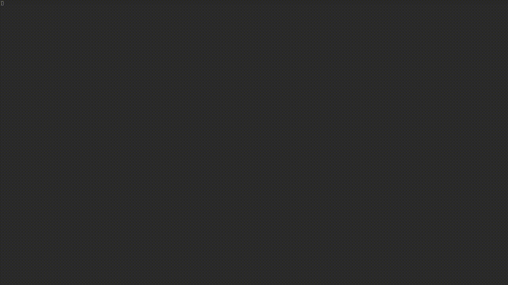

# screencaster

Write a YAML script, run one command, get a narrated MP4 of a website. Offline, re-renderable, no LLM at render time.



*This demo was made with screencaster itself.*

## Quick start

1. **Clone and build** (Go 1.25; `go.work` is committed):
   ```bash
   go build -o screencaster ./cli
   go build -o screencaster-mcp ./mcp
   ```

2. **Docker** (recommended; one image holds both binaries, Chromium, the Piper TTS provider with both voices, and ffmpeg):
   ```bash
   docker compose build    # or: make image (tags screencaster:piper and screencaster)
   docker compose run --rm screencaster render demos/my-demo.yaml
   ```
   - `compose.yaml` sets `--init` (forwards SIGTERM, so a stopped render cleans up), `--shm-size=1g`, the `host.docker.internal` host mapping and the `.:/work` mount.
   - The host mapping lets `baseUrl: http://host.docker.internal:3000` reach an app on the host (Linux).
   - Plain Docker works too: `docker run --rm --init --shm-size=1g --add-host=host.docker.internal:host-gateway -v $(pwd):/work screencaster screencaster render demos/my-demo.yaml`.
   - The container runs as root: the rendered files belong to root.
   - The TTS provider comes from the image's environment: the Piper image sets `SCREENCASTER_TTS=piper` plus `SCREENCASTER_PIPER_BIN` and `SCREENCASTER_PIPER_VOICES`. Both binaries exit at startup when `SCREENCASTER_TTS` is unset or unknown, so a hand-built image must set it. `make image-base` builds the same image without any provider.
   - The MCP server (`screencaster-mcp`) runs from the same image with `docker run -i`, see [Claude Code (MCP)](#claude-code-mcp).

3. **Write a demo** (`demos/my-demo.yaml`). One file holds everything: the target app, the optional login and the steps. Every path in a demo (`outputDir`, an intro or outro `image`) is relative to the demo file's folder and must stay inside the working directory (`/work` in Docker):
   ```yaml
   name: my-demo
   baseUrl: http://host.docker.internal:3000   # required, absolute http(s) URL
   storageState:                               # optional; omit for a public site
     cookies:
       - {name: session, value: <value>, domain: host.docker.internal, path: /}
   outputDir: output                           # optional, default output (next to the demo)
   languages: [en, pl]
   meta:
     title: How to create a project
     description: Create a project from the projects page.
     audience: release-notes
   intro:                                      # optional, default: a built-in card
     image: assets/logo.png                    # your own picture instead (PNG or JPEG)
   outro: false                                # no end card
   steps:
     - action: goto
       url: /projects
     - action: click
       selector: role=button[name="New project"]
       narration:
         en: Click the New project button.
         pl: Kliknij przycisk Nowy projekt.
     - action: fill
       selector: input[name="name"]
       value: My Project
   ```
   `narration` is optional on every step; a step without it is silent. A step that has it needs an entry for every selected language, and an empty string (`en: ""`) keeps the step silent in that language.

   `storageState` has the shape of Playwright's `context.storageState()` (`cookies`, `origins` with `localStorage`); paste an exported file here as it is (JSON is valid YAML). It holds live session secrets, so keep a demo that has one out of git. A demo for a public site is just `name`, `baseUrl` and `steps`: no other file is needed. A `screencaster.yaml` from an earlier version is ignored (with a warning); move its fields into the demo.

   **Start and end cards.** Every video starts with a 3 s card (the `meta` title and description) and ends with a 3 s card (a closing line in the video's language and the title), so it looks finished without an editing step. `intro` and `outro` change a card: `image` shows your picture full-frame (scaled to fit on a dark background; give it instead of `title` and `subtitle`), `title` and `subtitle` change the text, `durationMs` the time (500 to 10000), and `false` drops the card. The video is 6 s longer than the recording; use `intro: false` and `outro: false` for the plain recording. A demo for `demos/my-demo.yaml` with a logo keeps it in `demos/assets/logo.png`.

4. **Render**:
   - CLI: `screencaster render demos/my-demo.yaml` (`--lang en,pl` overrides the script's `languages`); it prints what it does on stderr (a start summary, one line per phase and language with its time, an end summary) and the video paths on stdout
   - MCP (in Claude Code): describe what you want, Claude writes the YAML and renders

## Docs

- **[PRD](docs/PRD.md)** — what it does, requirements, business logic
- **[ARCHITECTURE](docs/ARCHITECTURE.md)** — how it is built, pipeline, concurrency, data model
- **[CODE_QUALITY](docs/CODE_QUALITY.md)** — rules for writing and reviewing code

## Project layout

```
core/          shared library (no MCP, no SQLite); script.schema.json lives in core/script
cli/           screencaster render ... CLI
mcp/           screencaster-mcp MCP server
tests/e2e/     end-to-end tests (own module, local only)
testdata/      fixture HTML app and sample scripts
Dockerfile
Makefile
```

## Development

The host needs only Docker. Go, golangci-lint, Chromium, Piper and ffmpeg live in the dev image; the source is mounted, not copied.

```bash
make dev-image   # build the dev image once, rebuild when the Dockerfile changes
make test        # go test -race in core, cli, mcp, tests/e2e
make vet         # go vet in every module
make lint        # golangci-lint (incl. import-boundary rules) in every module
```

```bash
make image         # build the Piper runtime image (screencaster:piper, screencaster)
make image-base    # the provider-free base (screencaster-base)
make image-check   # built-in voices from the Piper adapter are present in it
make e2e           # real Chromium, Piper, ffmpeg in the dev image
make e2e-runtime   # the CLI tests against the runtime image
```

E2E runs locally only, not in CI. Run it on an idle machine: the recording lead-in test is timing-sensitive.

## Scripts

- `demos/*.yaml` — stored demo scripts (created via chat or CLI)
- `demos/output/*.mp4` — rendered videos, in `output/` next to the demo that made them, never overwritten (BR-006, FR-010)

## Key constraints

- One render at a time (BR-008, FR-014)
- 30 s timeout per step (BR-004, FR-008)
- 1920×1080 30 fps H.264 MP4 (FR-004, FR-009)
- Deterministic: no LLM at render time (BR-001)
- Offline TTS via Piper (§9)

## Notes

- Add extra voices for the active TTS provider to `/work/voices` (Piper: `*.onnx` plus `*.onnx.json`, FR-018). Voice names are the provider's own, so switching provider may need `voices:` edits in a script
- Add `.screencaster/` to the `.gitignore` of the project you render (render lock, job DB, temp files)

## Claude Code (MCP)

`screencaster-mcp` runs inside the image and talks to Claude Code over stdio. Add it to the project's `.mcp.json`, with `<project>` the absolute path of the repo that holds `demos/`:

```json
{
  "mcpServers": {
    "screencaster": {
      "command": "docker",
      "args": ["run", "-i", "--rm", "--init", "--add-host=host.docker.internal:host-gateway",
               "-v", "<project>:/work", "screencaster", "screencaster-mcp"]
    }
  }
}
```

- Tools: `render_video` (validates, queues a job, returns `jobId` and `position`), `get_render_status`, `explore_page` (takes an absolute `url` and an optional inline `storageState`; returns the accessibility tree with a ready-to-use selector on every interactive element) and `get_options` (installed languages and voices, audiences, existing demos).
- Prompt: `/mcp__screencaster__create_demo [description]` asks for languages, voices, audience, title, base URL and login (if any) in one message, explores the app, writes `demos/<name>.yaml` and renders it.
- Jobs run one at a time, oldest first, and are kept in `.screencaster/jobs.db`. Jobs still queued or running when the server stops are marked `failed` with `interrupted` at the next start; they do not resume.
- A CLI render and a queued job never run together: both take `.screencaster/render.lock`, and a job waits for it while still `queued`.
- `explore_page` does not wait for the queue and may overlap a running render, which can make the video's pacing jitter.
- Logs go to stderr; stdout carries protocol frames only.

## Author

Built by one developer. Not production software, no support.
