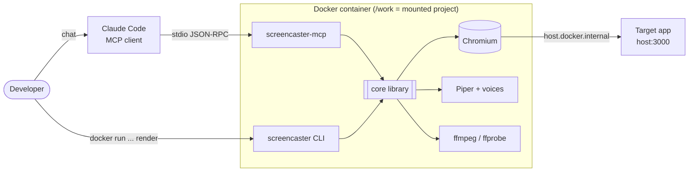
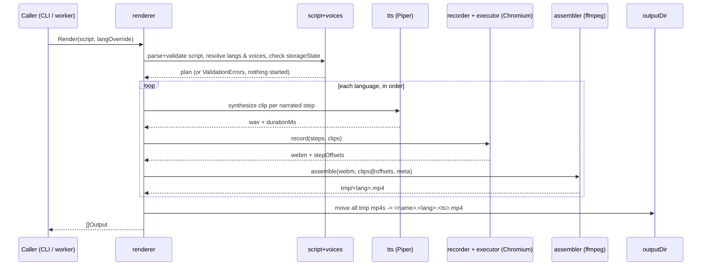
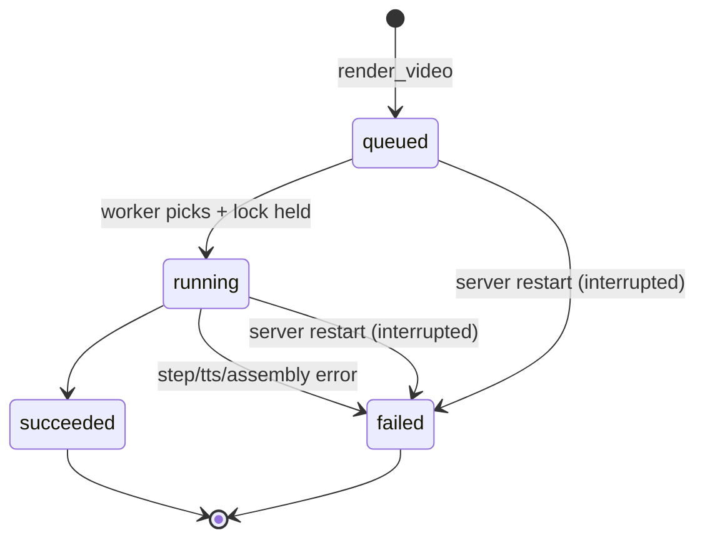

# screencaster — Architecture

**Version:** 0.1 | **Date:** 2026-10-03 | **Based on:** [PRD v1.3](PRD.md) | **Code rules:** [CODE_QUALITY.md](CODE_QUALITY.md) | **Status:** Draft

This document describes *how* screencaster is built. *What* it does is in the PRD. Requirement IDs (BR-, FR-, NFR-, BP-, UF-) link back to it.

## 1. Context and design drivers

| Driver | Source | Architectural consequence |
|--------|--------|---------------------------|
| Re-render must be deterministic, no LLM at render time | BR-001 | Render engine is a pure function of (script, voices, target app). Claude Code only authors YAML. |
| Narration and action start together; next step waits for both | BR-003, FR-007 | Audio is not played live. Clips are placed on a timeline by recorded offsets and mixed offline. |
| Any step failure aborts everything, no partial output | BR-004, FR-008, FR-010 | Work in a temp dir, move outputs only after all languages succeed. |
| Offline, $0 | NFR-003, §9 | No HTTP clients in code. Chromium is the only network user. |
| One developer, ≤ 10 videos/month | §9 | Few moving parts. One process, one worker, SQLite file. No scale design. |
| Same selectors in explore and render | Decision 23 | One step executor shared by both. |

Non-goals: multi-tenancy, parallel rendering, auth, any UI (PRD §10.3).

## 2. System context



Two entry points (`screencaster`, `screencaster-mcp`) are thin shells over one library (`core`). They share no code except through `core`.

## 3. Module view

Go workspace (`go.work`, committed, Decision 51), four modules (Decisions 29, 54).

```
core/                      library, no MCP, no SQLite
  script/                  types, embedded JSON Schema, cross-field    FR-001, FR-002
  voices/                  discover installed voices, resolve per lang BR-011, FR-018
  tts/                     Piper wrapper, WAV duration                 FR-003
  browser/                 playwright-go wrapper: launch, context      FR-004
  executor/                step execution (two modes)                  FR-005, FR-006
  recorder/                run one language: clips + steps -> webm + offsets   FR-004, FR-007
  assembler/               ffmpeg mix + transcode + mux + tags         FR-009
  renderer/                orchestrator: validate -> per-lang -> publish   FR-008, FR-010
  explorer/                explore_page logic                          FR-017
  lock/                    flock-based render lock                     see 6.3
  failure/                 error types                                 see 9
cli/                       screencaster render ...  (cobra)            FR-011
mcp/
  server/                  tool + prompt registration (go-sdk)         FR-012, 013, 017, 018, 019
  queue/                   SQLite store + single worker                FR-014, FR-015
tests/e2e/                 own module, //go:build e2e, `make e2e`      NFR-001, NFR-002
testdata/
  fixture-app/             static HTML app for e2e
  scripts/valid|invalid/   sample scripts for the core/script tests
Dockerfile                 stages: dev -> build -> runtime
Makefile                   dev-image, image, image-check, test, vet, lint, e2e, e2e-runtime (Go tooling runs in the dev image)
.golangci.yml              depguard rules for the dependency rules below
```

The JSON Schema lives next to the code that embeds it: `core/script/script.schema.json` (`go:embed` cannot reference a parent directory, Decision 55). `core/script/example.yaml` is the example shown in the `render_video` tool description.

**Dependency rules**

- `cli` → `core`. `mcp` → `core`. Never the reverse, and `cli` never imports `mcp`.
- `core` must not import SQLite or the MCP SDK.
- `core/renderer` talks to the recorder (browser), TTS and ffmpeg through small interfaces (`Recorder`, `Synthesizer`, `Assembler`). Unit tests use fakes. Only the e2e test uses the real tools.

## 4. Render pipeline

`renderer.Render(ctx, Deps, Request) ([]Output, error)` is the single code path for CLI and MCP (BR-001, FR-011). `Deps` holds the tools, the installed voices, the clock and the run-ID source; `Request.Progress` is told about each step before it runs (CLI progress on stderr). The only difference is the caller: CLI calls it directly, the MCP worker calls it after dequeueing.



Rules:

1. **Validate first.** Schema, baseUrl, narration-per-language, voice installed, storageState file, `storageState` and `outputDir` inside the working directory. All before any browser or TTS work (FR-001, FR-002, BR-011).
2. **Languages run sequentially**, each from a fresh browser context (FR-004).
3. **TTS before browser** for each language, because clip durations decide step timing (FR-003).
4. **Abort path.** First step error cancels the context, closes the browser, deletes the job temp dir and returns a `Failure`. Nothing reaches `outputDir`. If `en` succeeded and `pl` fails, the `en` MP4 is discarded too (BR-004).
5. **Publish last.** After all languages succeed, files are moved into `outputDir` with a single shared timestamp (FR-010, BR-006). Every target is checked for existence first. Move is `os.Rename`. If temp and output are on different filesystems, copy to `<name>.part` in `outputDir` (`O_EXCL`), then rename. Existing files are never opened for writing. If a move fails, the files already moved by this job are removed again.

## 5. Timing and synchronization model

This is the part most likely to go wrong, so it is defined precisely.

```
t0 ──────────────────────────────────────────────────────────► recording time
 │   step1 start        step2 start               step3 start
 │   │ action ▓▓▓       │ action ▓▓                │ action ▓
 │   │ clip   ░░░░░░░░░░│ (no narration)          │ clip ░░░░
 │   └─ next starts at max(action end, start+clip)  └─ next starts at action end
```

- **t0** is a monotonic timestamp taken immediately before the recorded page is created (ADR-46). Every step start offset is `now − t0 − LeadInCompensation` in ms (90 ms, clamped at 0), see the known risk below.
- For each step: record `offset`, start the action, then wait until `max(actionEnd, offset + clipDuration)` if narrated, else continue at `actionEnd` (BR-003, FR-007).
- Narration is **not** played during recording. Assembler places each clip at `adelay=<offset>ms` and mixes (FR-009.1). So audio sync does not depend on real-time playback.
- Playwright's WebM is variable frame rate. The transcode forces constant 30 fps (`-r 30` / `fps=30` filter) so video time equals wall time and offsets stay valid.
- Output duration is the video length (FR-009.4). The last narrated step waits for its clip, so the video always covers the audio. The assembler therefore mixes the clips without padding; an endless `apad` with `-shortest` never terminates in ffmpeg 5.1 (found in M3). With no narrated step, `anullsrc` is mapped directly and cut by `-shortest`.
- Target drift: ±100 ms (FR-007 AC). The e2e test measures actual drift by checking an audible/visible marker step against its offset, and accepts **±150 ms** (`maxDrift` in `tests/e2e/render_test.go`): a runtime-image run measured 125 ms because the WebM start is not fixed (see the lead-in note below and §17.1). This is a deviation from FR-007, kept until the lead-in is measured per recording.

**Lead-in (spike S1, ADR-46):** Playwright's video time 0 is about 90 ms after page creation, so a clip placed at the raw offset would play that much late. The recorder subtracts the fixed constant `recorder.LeadInCompensation` (90 ms) from every offset. No trimming. **Known limit:** the video start is bimodal (§17.1), so in some recordings the fixed constant is wrong and narration plays late.

## 6. Concurrency model

### 6.1 Processes

- `screencaster-mcp`: long-lived, one per Claude Code session (`docker run -i --rm`).
- `screencaster`: short-lived, one per CLI render.
- Both can be alive at once on the same `/work`.

### 6.2 Inside `screencaster-mcp`

| Goroutine | Role |
|-----------|------|
| MCP server loop | Serves stdio. `render_video` validates, inserts a job, signals the worker. `get_render_status` reads SQLite. |
| Queue worker (exactly one) | Dequeues oldest `queued`, takes the render lock (6.3), sets `running`, calls `renderer.Render`, writes the result (BR-008, FR-014). |
| `explore_page` handlers | Run on the request goroutine. A mutex serializes them against each other (FR-017). They do **not** wait for the worker. |

**Explore may overlap a render** (ADR-44). Two Chromiums can then run at once. Consequences:

- Render timing can jitter while an explore call runs. Narration offsets stay correct because they come from recorded timestamps, not from a fixed schedule. Only the pacing of the video changes.
- NFR-001 (≤ 2× duration) is measured in the e2e test with no explore running.
- If this proves a problem in practice, add a shared semaphore later. No interface change is needed, since only the browser launch point is involved.

### 6.3 Render lock

CLI bypasses the queue (BP-003), so a CLI render and an MCP job could run together. A lock file prevents it (ADR-45).

- Path: `<work>/.screencaster/render.lock`, `flock(LOCK_EX)`.
- **CLI:** non-blocking attempt. If held, print `another render is running` and exit 1.
- **Worker:** blocking acquire with retry before setting the job `running`. A job waiting on the lock stays `queued`.
- Released on process exit by the kernel, so a crash cannot leave a stale lock.
- Works across containers because they share the same host kernel through the bind mount.
- `explore_page` does not take the lock.
- **MCP startup** tries the lock without waiting before it empties `tmp/` (§11). If a CLI render holds it, the temp dirs stay; the next start removes them.

### 6.4 Shutdown

Claude Code closing stdin or `docker stop` sends the process a signal or EOF. Handler cancels the root context: browser closes, job temp dir is deleted, process exits. The job row stays `running` and BR-009 marks it `interrupted` at next start. The docs recommend `docker run --init` so signals are forwarded.

## 7. Step executor (shared)

One implementation of FR-005 semantics, two modes:

| | `render` mode | `explore` mode |
|---|---|---|
| Cursor overlay (init script) | yes | no |
| Mouse glide, 25 steps | yes | no |
| Typing delay 60 ms/char | yes | no |
| Records step offsets | yes | no |
| Timeout per action | 30 s | 30 s |

```go
type Mode struct { Visuals bool }
func (e *Executor) Run(ctx context.Context, i int, s script.Step) error // returns *failure.StepFailure
```

Same selectors, same URL resolution against the script's `baseUrl` (BR-010), same error shape. That is the guarantee behind FR-017 AC3: *a selector returned by `explore_page` works in a render*.

**Selector strictness.** A selector matching several elements must fail, not silently click the first one. Executor uses strict locators. `explore_page` therefore emits only selectors that match exactly one element, and adds `>> nth=N` when names collide.

## 8. `explore_page` design

- Fresh non-recorded context: 1920×1080, `storageState` and `baseURL` from the tool input (FR-017). `baseURL` is the absolute `url` itself, so a relative `goto` in `actions` resolves against the explored page (decision 59).
- Replays `actions` with executor in `explore` mode, then captures the page.
- Snapshot source: Playwright ARIA snapshot (`Locator.AriaSnapshot` on `body`), lines like `- button "New project"`, `- textbox "Name": Demo`, `- option "Public" [selected]`, indented by nesting (spike S4, §17). The explorer appends ` -> role=<role>[name="<name>"]` right after the name and attributes of every named line whose role is interactive (button, link, textbox, checkbox, radio, combobox, menuitem, tab, option). It checks uniqueness with a `Count` call against the live page and adds ` >> nth=<i>` on a collision, `i` counting the earlier lines with the same selector (ADR-47).
- Output capped at 50 000 chars with `truncated: true`.
- On action failure: tool error with `{step, action, target, message}` plus the snapshot at that moment (FR-017 edge case). The initial navigation is step 0, the `actions` are steps 1..n.
- Concurrent calls queue on a package-level mutex in `core/explorer`.

## 9. Error model

One type travels everywhere (`core/failure`):

```go
type Failure struct {
    Step    *int   // 1-based; nil for non-step failures
    Lang    string
    Action  string
    Target  string // selector or URL
    Message string
}
```

| Kind | Produced by | Message format | CLI | MCP |
|------|-------------|----------------|-----|-----|
| Validation | script, voices, renderer (paths) | list of `{pointer, message}` | print, exit 1 | tool error, no job created |
| Step | executor | BR-004 fields | print, exit 1 | `jobs.error_json` |
| TTS | tts | `tts failed at step <n> (<lang>): <stderr>` | print, exit 1 | `error_json.message` |
| Assembly | assembler | `assembly failed (<lang>): <last 20 stderr lines>` | print, exit 1 | `error_json.message` |
| Interrupted | startup recovery | `{message: "interrupted"}` | n/a | `error_json` |

## 10. Job queue and persistence (MCP only)

SQLite via `modernc.org/sqlite`, file `<work>/.screencaster/jobs.db`. Schema is PRD §13. Additional notes:

- Index on `(status, created_at)` for dequeue and position.
- `created_at` is RFC 3339 UTC with a fixed 9-digit fraction (`2006-01-02T15:04:05.000000000Z`, Decision 57); `rowid` breaks ties, so back-to-back submissions keep FIFO order.
- `PRAGMA journal_mode=WAL; PRAGMA busy_timeout=5000;`. Only the MCP process opens the DB, so contention is limited to the request goroutines and the worker.
- `position` (for `queued` jobs) = number of `queued` jobs ordered before it by `(created_at, rowid)`, plus 1; a running job does not count.
- Worker is woken by a buffered channel (`cap 1`) on insert. No polling loop needed. On start, recovery runs first (FR-015), so nothing is stale.



## 11. File layout

```
/work                          mounted project (rw)
├── demos/*.yaml               scripts, each with its own baseUrl, storageState, outputDir (FR-001)
├── auth/storageState.json     path from the demo's storageState; optional; contains secrets
├── voices/*.onnx(+.json)      extra Piper voices (FR-016)
├── output/                    <name>.<lang>.<ts>.mp4  (never overwritten)
└── .screencaster/
    ├── jobs.db                MCP only
    ├── render.lock
    └── tmp/<runId>/<lang>/    clips/*.wav, video/*.webm, out.mp4
```

- `runId` is the job UUID for MCP and a random ID for CLI. The temp dir is removed on success and on abort.
- At MCP start, `queue.RemoveStaleTemp` removes any `tmp/*` left by interrupted renders, but only while it holds the render lock: a CLI render running at that moment has its own `tmp/<runId>` there (§6.3).
- Add `.screencaster/` to the project's `.gitignore` (documented in README).

## 12. Docker image

- Base: Debian slim with Chromium system deps (installed through the playwright-go driver install step).
- Contents: `screencaster`, `screencaster-mcp`, Playwright Node driver + Chromium, Piper binary (`/opt/piper/piper`, release 2023.11.14-2, libs and espeak-ng data next to it), voices `en_US-ryan-high` and `pl_PL-darkman-medium` under `/opt/piper/voices`, `ffmpeg`/`ffprobe` (FR-016). Piper and the voices are sha256-pinned.
- Voice discovery scans `/opt/piper/voices` and `/work/voices`. The language code is the voice name up to the first `_` (FR-018).
- Network: `--add-host=host.docker.internal:host-gateway` makes a demo's `baseUrl` reach the host app on Linux (Decision 27).
- **Stdio hygiene.** MCP uses stdout for protocol frames. All logging goes to stderr. Subprocess stdout/stderr (Piper, ffmpeg, Playwright driver) is captured and never inherited. A stray byte on stdout corrupts the session.
- Image build is multi-stage: `piper` (Piper + voices, shared with `dev`), `dev` (toolchain for `make`), `build` (static `screencaster` and `screencaster-mcp`, plus the playwright CLI at the version `core/go.mod` pins), `runtime` (last, so `docker build .` yields it). `runtime` is `debian:bookworm-slim` + Chromium (via `playwright install --with-deps`) + ffmpeg + Piper + both binaries in `/usr/local/bin`.
- The runtime image runs as root with `WORKDIR /work`, so output files in the mounted project are owned by root. Use `docker run --init` so SIGTERM reaches the process (§6.4).
- `make image-check` lists `/opt/piper/voices` in the image and requires the `.onnx` and `.onnx.json` of every built-in voice in `core/voices`.

## 13. Testing strategy

| Level | Scope | Tools |
|-------|-------|-------|
| Unit | schema, baseUrl and storageState checks, cross-field rules, voice resolution, offset math, `max(...)` wait rule, error formatting, queue ordering, recovery | `go test`, fakes for `Recorder`, `Session`, `Synthesizer`, `Assembler` |
| Integration | SQLite store, lock file semantics, MCP tool/prompt wiring via in-memory transport | `go test` |
| E2E (1) | Fixture app → real render EN, and EN+PL → ffprobe (h264, 1920×1080, 30 fps, aac), drift check, NFR-001 ratio, selector from `explore_page` used in a render | `make e2e` in the dev image, locally (Decision 54); `make e2e-runtime` runs the CLI tests against the runtime image (Decision 56) |

CI (GitHub Actions): `golangci-lint`, `go vet`, `go test -race` per module; an `image` job (`make image` + `make image-check`, no push). E2E does not run in CI (Decision 54).

## 14. Security notes

Local single-user tool (PRD §14), so the model is minimal:

- `storageState` holds live session cookies. Keep it out of git. The container has the project mounted rw but no other host access.
- No outbound network except Chromium to `baseUrl` and any absolute `goto` URLs (NFR-003).
- Scripts are data, not code. YAML is parsed into typed structs and the schema rejects unknown fields. Selectors go to Playwright only.

## 15. Extension points (post-MVP)

- **Slides / overlays** (PRD §10.2): not designed for in MVP. `recorder` produces one recording per language. When slides arrive, change the recorder output and assembler then. Overlays would hook in as an executor-level init script, like the cursor.
- **New languages:** no code change. Drop `.onnx` + `.onnx.json` into `/work/voices`.
- **Other TTS engines:** behind `Synthesizer`. Explicitly out of scope now.

## 16. Architecture decisions

Numbering continues the PRD Decisions Log (last: 43). 44–55 and 58–60 are also in the PRD log; 56 and 57 are only here.

| # | Decision | Alternatives | Rationale |
|---|----------|--------------|-----------|
| 44 | `explore_page` may overlap a running render; no shared browser lock | Shared semaphore; reject during render | User choice. Offsets come from timestamps, so correctness holds. Revisit if timing jitter shows up. |
| 45 | `flock` lock file `.screencaster/render.lock` guards CLI vs MCP worker. CLI fails fast, worker waits | No lock; CLI enqueues via SQLite | User choice. Kernel releases on crash. Keeps PRD rule that CLI has no queue or job record. |
| 46 | Recording `t0` = monotonic timestamp just before recorded page creation; no trimming; fixed compensation (90 ms, measured in the M2 spike, see §17) | Trim lead-in with `ffmpeg -ss` | User choice. Fewer moving parts. |
| 47 | `explore_page` snapshot = ARIA snapshot plus derived, uniqueness-checked selectors | Deprecated `page.Accessibility.Snapshot`; raw DOM dump | Supported API. Guarantees the "selector works in render" AC. Format confirmed in spike S4 (§17). |
| 48 | Logs to stderr only, subprocess output captured | — | Required by MCP stdio. |
| 49 | Clip duration read from the WAV header, not ffprobe | Spawn ffprobe per clip | No subprocess per clip, exact for PCM WAV. Piper emits PCM s16le WAV (confirmed in the M3 spike, see §17). |
| 50 | Constant 30 fps forced during transcode | Pass VFR through | Keeps video time equal to wall time for `adelay` offsets. |
| 51 | Commit `go.work` and `go.work.sum` | Ignore and generate in CI/Docker | One source of truth for CI, the image and contributors. |
| 52 | Dev Docker image from M1; every `make` target runs in it | Host Go install | The host has only Docker; one toolchain everywhere. golangci-lint is pinned to v2.12.0, the newest release that builds on Go 1.25. |
| 53 | `cobra` for the CLI | std `flag` | User choice; documented deviation from KISS (CODE_QUALITY). |
| 54 | e2e in module `tests/e2e`, local only (`make e2e`) | In-module e2e; e2e in CI | User choice; keeps CI fast and cheap. The pipeline is not verified in CI. |
| 55 | Schema at `core/script/script.schema.json` | Root `schema/` | `go:embed` cannot reference parent directories. |
| 56 | `make e2e-runtime`: the e2e test binary is compiled in the dev image and runs inside the runtime image, with `SCREENCASTER_BIN` pointing at the image's binary; the test process serves the fixture on 127.0.0.1 | CLI binary in the image, fixture in the dev container over a docker network (the original M4 plan) | Same coverage of the image's binary, Chromium, Piper and ffmpeg. No network, no docker-in-docker, nothing to orchestrate. |
| 57 | Job timestamps use a fixed-width UTC layout with 9 fraction digits, not `RFC3339Nano` | `RFC3339Nano` | `RFC3339Nano` trims trailing zeros, so `…05Z` sorts after `…05.1Z` as text and breaks the `ORDER BY created_at`. Still valid RFC 3339. |
| 58 | Each demo is one self-contained YAML: `baseUrl` required, `storageState` and `outputDir` optional, `screencaster.yaml` and `core/config` removed (a warning names a stray file: CLI on every render, MCP once at startup). Supersedes PRD decision 15 | Optional `screencaster.yaml` fallback; paths relative to the demo file; a slim `core/config` for path helpers | User choice. No hidden project state. The URL rule (`script.AbsoluteHTTP`) lives in Go, the field shape in the schema. The storageState check and the rule that `storageState` and `outputDir` stay inside the working directory live in `core/renderer` (`Prepare`, and `StorageStatePath` shared with `explore_page`), which already does file I/O; the script and the tool input are LLM-written, so their paths are not trusted. |
| 59 | `explore_page` takes an absolute `url` plus an optional `storageState`; the url is also the explorer's `BaseURL` | Path plus a `baseUrl` input | Nothing to read from disk. Relative gotos in `actions` resolve against the explored page, so `core/explorer` and `core/executor` stay unchanged. |
| 60 | No project-level voice defaults: script, then built-in | Keep config voices; env-var defaults | Follows from 58. `voices.Resolve` and `Options` lose the config parameter. |

## 17. Open items for spikes

1. **M2:** measure the gap between page creation and first recorded frame (ADR-46). **Done: compensation added.** Method: `t0` just before `NewPage`, `goto marker.html`, wait 1 s, click `#marker` (full-viewport white flash), then find the first dark→bright frame in the raw WebM with ffmpeg `signalstats`. Over 10 runs (dev image, playwright-go v0.6201.1) the flash frame sits **52–129 ms before** the click's offset from `t0`, mean ≈ 90 ms; 2 of 10 runs exceed 100 ms. The WebM has a 40 ms frame step, so each sample is ±40 ms. The sign is consistent: video time 0 is ~90 ms after `t0`, so clips placed at raw offsets play ~90 ms late. The mean sits just under the ADR-46 gate but the spread does not, so `recorder.LeadInCompensation = 90ms` is subtracted from every offset (clamped at 0). With it the residual is about ±40 ms. `TestRecord_leadInIsWithinTolerance` guards it; the M3 drift e2e measures audio vs flash end to end. **Later finding (2026-10-04): the start is bimodal.** Recording `projects.html` → `marker.html` → click, 15 runs: in 10, video time 0 ≈ t0 + 60 ms; in 5, the first page's frames are missing and video time 0 ≈ t0 + 590 ms, so narration is ~0.5 s late (one full render measured −1.464 s). S1 (about:blank → marker at once) cannot see this. One runtime-image e2e run measured 125 ms, which is why the e2e accepts ±150 ms (§5). Open: measure the lead-in per recording instead of the constant.
2. **M2:** confirm strict-locator behavior of playwright-go for `click`/`hover`/`fill` and that ambiguous selectors fail with a usable message. **Done: passes.** Locators are strict by default. A selector matching 2 elements fails in ~10 ms for click, hover, fill and the cursor glide, with `strict mode violation: locator('a') resolved to 2 elements:` plus the candidates. The executor uses this directly, with no `Count()` pre-check. Guarded by `TestBrowser_ambiguousSelectorFailsFast` (e2e).
3. **M3:** confirm Piper CLI flags and WAV format (sample rate, PCM) for ADR-49. **Done: passes.** `piper --model <voice>.onnx --output_file <out.wav>` with the text on stdin works for both built-in voices; no `--espeak_data` is needed because the binary finds `espeak-ng-data` next to itself. Output is PCM s16le, 22050 Hz, mono, with a plain `fmt ` (16 bytes) + `data` layout. The header duration (data bytes / byte rate, 80104 / 44100 = 1.816417 s) equals ffprobe's. Piper prints the output path on stdout (so stdout must not be inherited) and logs to stderr; a missing model aborts with exit 134 and `what(): Model file doesn't exist`. ADR-49 stands. Guarded by `TestParseWAV_durationFromHeader`.
4. **M5:** confirm `Locator.AriaSnapshot` output in playwright-go and build the role→selector mapper (ADR-47). **Done: passes.** `page.Locator("body").AriaSnapshot()` returns YAML-like text, one `- role "name" [attrs]: value` line per node, two spaces per nesting level. On the fixture's projects page after opening the form:
   ```
   - heading "Projects" [level=1]
   - button "New project"
   - textbox "Name": Demo
   - combobox "Visibility":
     - option "Public" [selected]
   - button "Create"
   - contentinfo: Footer
   ```
   Nameless nodes (`- text: Name`) carry no quotes. A regexp over the leading `- role "name"` is enough to map lines to `role=<role>[name="<name>"]`, so the `Evaluate` DOM-walk fallback is not needed. The `role=` selector compares the whole name (`"Save"` does not match `"Save all"`), so the `Count` check and `>> nth=` suffix are needed only for repeated names. Guarded by `TestExplore_selectorsWorkInARender`, `TestExplore_selectorsPickTheirOwnElement` (e2e) and the mapper unit tests.

## 18. PRD inconsistencies

None open. The glossary, FR-002 (embed wording, schema path), FR-014 (render lock) and §18 repo structure were aligned with this document in M1.
