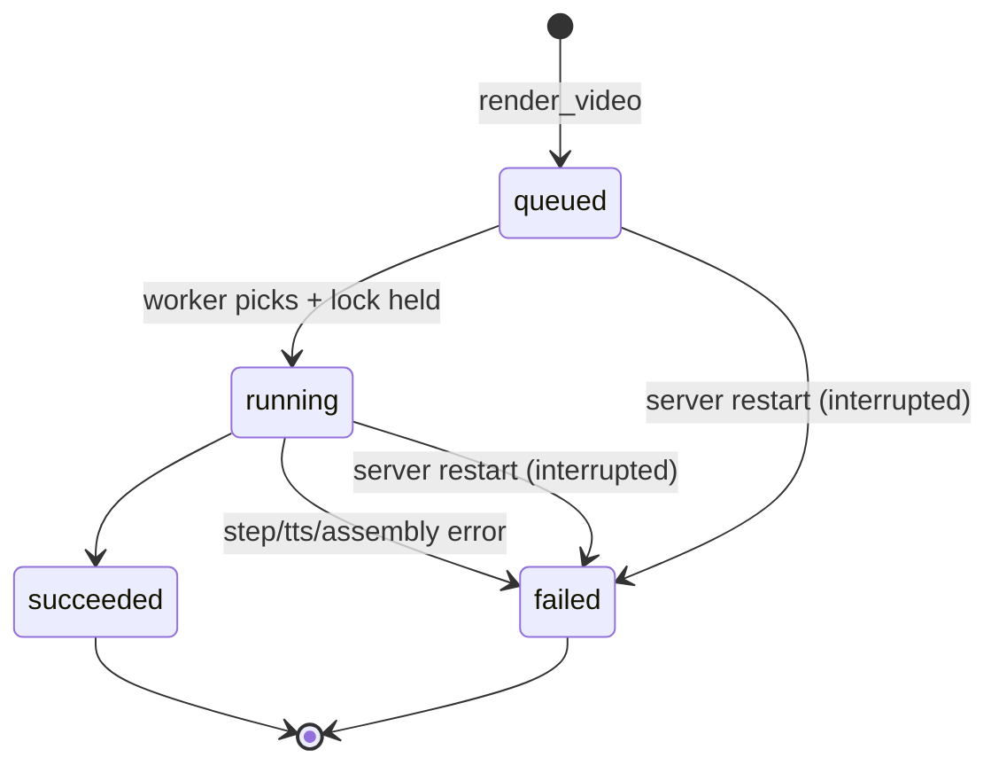

# screencaster — Architecture

**Version:** 0.2 | **Date:** 2026-10-05 | **Based on:** [PRD v1.3](PRD.md) | **Code rules:** [CODE_QUALITY.md](CODE_QUALITY.md) | **Status:** Draft

This document holds the structural rules: how the code is divided, what may depend on what, and the invariants the render pipeline keeps. *What* the product does is in the PRD; constants, formats and measurements live in the code and its tests. Requirement IDs (BR-, FR-, NFR-, BP-) link back to the PRD.

## 1. Context and design drivers

| Driver | Source | Consequence |
|--------|--------|-------------|
| Re-render is deterministic, no LLM at render time | BR-001 | The render engine is a pure function of (script, voices, target app). Claude Code only authors YAML. |
| Narration and action start together; the next step waits for both | BR-003, FR-007 | Audio is never played live. Clips are placed on a timeline by recorded offsets and mixed offline. |
| Any step failure aborts everything, no partial output | BR-004, FR-008, FR-010 | Work in a temp dir, publish only after every language succeeded. |
| Offline, $0 | NFR-003 | No HTTP clients in code. Chromium is the only network user. |
| One developer, few videos | PRD §9 | Few moving parts: one process, one worker, one SQLite file. No scale design. |
| Same selectors in explore and render | Decision 23 | One step executor serves both. |

Non-goals: multi-tenancy, parallel rendering, auth, any UI (PRD §10.3).

## 2. System context


Two entry points are thin shells over one library (`core`). They share code only through `core`.

## 3. Module view

Go workspace (`go.work`, committed), four modules.

```
core/                      library, no MCP, no SQLite
  script/                  types, embedded JSON Schema, cross-field rules   FR-001, FR-002
  voices/                  discover installed voices, resolve per language  BR-011, FR-018
  tts/                     Piper wrapper, WAV duration                      FR-003
  browser/                 playwright-go wrapper: launch, context, screenshots   FR-004
  card/                    built-in start/end card page                     FR-009
  executor/                step execution (two modes)                       FR-005, FR-006
  recorder/                one language: clips + steps -> webm + offsets    FR-004, FR-007
  assembler/               ffmpeg: mix, cards, transcode, mux, tags         FR-009
  renderer/                orchestrator: validate -> per language -> publish   FR-008, FR-010
  explorer/                explore_page logic                               FR-017
  lock/                    flock-based render lock                          §6.3
  failure/                 error types                                      §9
cli/                       screencaster render ...                          FR-011
mcp/
  server/                  tool and prompt registration                     FR-012, 013, 017, 018, 019
  queue/                   SQLite store + single worker                     FR-014, FR-015
tests/e2e/                 own module, //go:build e2e
testdata/                  fixture app and sample scripts
```

The JSON Schema sits next to the code that embeds it (`core/script`), because `go:embed` cannot reach a parent directory (Decision 55).

**Dependency rules**

- `cli` → `core`, `mcp` → `core`. Never the reverse; `cli` never imports `mcp`.
- `core` imports neither SQLite nor the MCP SDK.
- Only `core/tts`, `core/assembler` and `core/browser` start subprocesses or call playwright-go. Everything else uses them through interfaces.
- `core/renderer` reaches the browser, TTS and ffmpeg through small interfaces declared by the consumer (`Recorder`, `Synthesizer`, `Assembler`, `Cards`). Unit tests use fakes; only e2e uses the real tools.
- Enforced by `depguard` in `.golangci.yml`.

## 4. Render pipeline

`renderer.Render(ctx, Deps, Request)` is the single code path for CLI and MCP (BR-001, FR-011); the caller is the only difference. `Deps` holds the tools, the voices, the clock and the run-ID source. `Request.Progress` and `Request.Log` report progress; the wording lives in `renderer`, the caller decides where it goes (stderr, `slog`; Decision 64).


Rules:

1. **Validate first.** Everything checkable without a browser or TTS is checked before either starts: schema, `baseUrl`, narration per language, installed voices, paths inside the working directory (BR-011, FR-001, FR-002).
2. **Languages run sequentially**, each from a fresh browser context (FR-004).
3. **TTS before browser**, because clip durations decide step timing (FR-003). Cards come right after TTS, so a card problem fails before the slow part.
4. **Abort path.** The first step error cancels the context, closes the browser, deletes the temp dir and returns a `Failure`. Nothing reaches `outputDir`; a finished `en` is discarded when `pl` fails (BR-004).
5. **Publish last.** After all languages succeed, files move into `outputDir` with one shared timestamp (FR-010, BR-006). Every target is checked for existence first, existing files are never opened for writing, a cross-filesystem move goes through `<name>.part` then rename, and a failed move removes what the job already moved.

## 5. Timing and synchronization model

The part most likely to go wrong, so it is defined precisely.

```
t0 ──────────────────────────────────────────────────────────► recording time
 │   step1 start        step2 start               step3 start
 │   │ action ▓▓▓       │ action ▓▓                │ action ▓
 │   │ clip   ░░░░░░░░░░│ (no narration)          │ clip ░░░░
 │   └─ next starts at max(action end, start+clip)  └─ next starts at action end
```

- **t0** is a monotonic timestamp taken just before the recorded page is created (Decision 46). A step's offset is `now − t0 − LeadInCompensation`, clamped at 0.
- Per step: record the offset, start the action, then wait until `max(actionEnd, offset + clipDuration)` if narrated, else continue at `actionEnd` (BR-003, FR-007).
- Narration is not played while recording. The assembler places each clip at its offset and mixes offline, so sync does not depend on real-time playback.
- The transcode forces a constant frame rate, so video time equals wall time and offsets stay valid (Decision 50).
- The video is `intro card + recording + outro card`. The recorder knows nothing of the cards: its offsets are relative to the recording and the assembler adds the intro length. Every concat input is finite.
- Output length is the video length (FR-009.4). The last narrated step waits for its clip, so the video always covers the audio; the assembler mixes clips without padding.
- Drift target ±100 ms (FR-007). The e2e check accepts a wider bound while the lead-in is a constant (§17.1).

**Lead-in (Decision 46):** the video starts a little after page creation, so the recorder subtracts a fixed `LeadInCompensation` from every offset instead of trimming. Known limit: the real start is bimodal (§17.1), so in some recordings narration plays late.

**Start page:** a new page is white until the first `goto` paints, which would flash white after the start card. The recorded page therefore shows the intro picture on the card background first (`recorder.Input.StartImage`), so the card carries on until the site appears; with no intro it is the plain card colour. The paint happens after `t0`, so offsets are unaffected.

## 6. Concurrency model

### 6.1 Processes

- `screencaster-mcp`: long-lived, one per Claude Code session.
- `screencaster`: short-lived, one per CLI render.
- Both may run at once on the same `/work`.

### 6.2 Inside `screencaster-mcp`

| Goroutine | Role |
|-----------|------|
| MCP server loop | Serves stdio. `render_video` validates, inserts a job and wakes the worker. `get_render_status` reads SQLite. |
| Queue worker (exactly one) | Takes the oldest `queued` job, acquires the render lock (§6.3), sets `running`, calls `renderer.Render`, stores the result (BR-008, FR-014). |
| `explore_page` handlers | Run on the request goroutine, serialized by a mutex. They do not wait for the worker. |

**Explore may overlap a render** (Decision 44). Render timing can jitter, but offsets come from recorded timestamps, so narration stays correct. If it becomes a problem, add a shared browser semaphore; no interface changes.

### 6.3 Render lock

The CLI bypasses the queue (BP-003), so a lock file keeps a CLI render and an MCP job apart (Decision 45).

- `<work>/.screencaster/render.lock`, `flock(LOCK_EX)`; the kernel releases it on exit, so a crash leaves nothing stale. It works across containers sharing the bind mount.
- **CLI:** one non-blocking attempt; if held, print `another render is running` and exit 1.
- **Worker:** blocking acquire before the job becomes `running`; a waiting job stays `queued`.
- `explore_page` does not take the lock.
- MCP startup tries the lock without waiting before it clears `tmp/` (§11); if a CLI render holds it, the next start cleans up.

### 6.4 Shutdown

EOF on stdin or a signal cancels the root context: the browser closes, the temp dir goes, the process exits. The job row stays `running` and recovery marks it `interrupted` at next start (BR-009). Run containers with `--init` so signals are forwarded.

## 7. Step executor (shared)

One implementation of FR-005 semantics, two modes:

| | `render` | `explore` |
|---|---|---|
| Cursor overlay, mouse glide, typing delay | yes | no |
| Records step offsets | yes | no |
| Timeout per action | 30 s | 30 s |

Same selectors, same URL resolution against `baseUrl` (BR-010), same error shape. That is the guarantee behind FR-017 AC3: a selector returned by `explore_page` works in a render.

**Selector strictness.** A selector matching several elements fails instead of clicking the first. The executor uses strict locators, so `explore_page` emits only selectors that match one element and disambiguates with `>> nth=N`.

## 8. `explore_page` design

- Runs in a fresh, non-recorded context with the caller's `storageState`. The `url` is also the `baseURL`, so relative `goto`s in `actions` resolve against the explored page (Decision 59).
- Replays `actions` through the executor in `explore` mode, then captures the page as an ARIA snapshot (Decision 47). Each named interactive line gets a ready-to-use selector, checked for uniqueness against the live page.
- Output is capped (`truncated: true`).
- On an action failure the tool returns `{step, action, target, message}` plus the snapshot at that moment (FR-017). The initial navigation is step 0.

## 9. Error model

One type travels everywhere (`core/failure`):

```go
type Failure struct {
    Step    *int   // 1-based; nil for non-step failures
    Lang    string
    Action  string
    Target  string // selector or URL
    Message string
}
```

| Kind | Produced by | CLI | MCP |
|------|-------------|-----|-----|
| Validation (list of `{pointer, message}`) | script, voices, renderer | print, exit 1 | tool error, no job created |
| Step | executor | print, exit 1 | `jobs.error_json` |
| TTS, Assembly, Cards | tts, assembler, renderer | print, exit 1 | `error_json.message` |
| Interrupted | startup recovery | n/a | `error_json` |

Step, TTS, assembly and card failures become a `Failure` before they leave `core`. Messages name the step or phase and the language, and include the tool's stderr tail where there is one.

## 10. Job queue and persistence (MCP only)

SQLite (`modernc.org/sqlite`), file `<work>/.screencaster/jobs.db`; schema in PRD §13. Only the MCP process opens it.

- FIFO by `(created_at, rowid)`. Timestamps use a fixed-width UTC layout so text order equals time order (Decision 57). A job's `position` counts the `queued` jobs before it plus one; a running job does not count.
- WAL mode with a busy timeout. The worker is woken by a buffered channel on insert, no polling. Recovery runs first at start (FR-015).



## 11. File layout

```
/work                          mounted project (rw)
├── demos/*.yaml               scripts: baseUrl, optional storageState and outputDir (FR-001)
├── demos/assets/*             card pictures named by intro.image / outro.image
├── demos/output/              <name>.<lang>.<ts>.mp4, never overwritten
├── voices/*.onnx(+.json)      extra Piper voices (FR-016)
└── .screencaster/
    ├── jobs.db                MCP only
    ├── render.lock
    └── tmp/<runId>/<lang>/    clips, video, cards, out.mp4
```

- Every path in a demo resolves against the demo file's folder and must stay inside the working directory (Decision 62).
- `runId` is the job UUID (MCP) or a random ID (CLI). The temp dir is removed on success and on abort.
- MCP startup removes stale `tmp/*`, only while it holds the render lock (§6.3).
- `.screencaster/` belongs in the project's `.gitignore`.

## 12. Docker image

- One multi-stage image: `piper` (Piper + voices), `dev` (toolchain for `make`), `build` (static binaries), `runtime` (last, so `docker build .` yields it). The runtime holds both binaries, Chromium, ffmpeg, Piper and the built-in voices. Piper and the voices are checksum-pinned.
- Voice discovery scans the image's voice folder and `/work/voices`; the language is the voice name up to the first `_` (FR-018).
- `--add-host=host.docker.internal:host-gateway` lets a `baseUrl` reach the host app on Linux (Decision 27). The container runs as root, so output files are root-owned.
- **Stdio hygiene.** MCP uses stdout for protocol frames, so all logging goes to stderr and subprocess output (Piper, ffmpeg, the Playwright driver) is captured, never inherited. A stray byte on stdout corrupts the session.
- Go tooling runs in the dev image (Decision 52); `make image-check` verifies the built-in voices are in the image.

## 13. Testing strategy

| Level | Scope | Tools |
|-------|-------|-------|
| Unit | schema and cross-field rules, voice resolution, offset math, the wait rule, error formatting, queue ordering, recovery | `go test`, fakes for `Recorder`, `Session`, `Synthesizer`, `Assembler`, `Cards` |
| Integration | SQLite store, lock semantics, MCP wiring over an in-memory transport | `go test` |
| E2E | fixture app → real render (EN, EN+PL), output format, drift, duration ratio (NFR-001), an `explore_page` selector used in a render | `make e2e` in the dev image; `make e2e-runtime` runs the CLI tests against the runtime image (Decisions 54, 56) |

CI runs lint, vet and `go test -race` per module plus an image build; e2e runs locally only (Decision 54).

## 14. Security notes

Local single-user tool (PRD §14), so the model is minimal:

- An inline `storageState` holds live session cookies: keep such a demo out of git.
- No outbound network except Chromium to `baseUrl` and absolute `goto` URLs (NFR-003).
- Scripts are data. YAML parses into typed structs, the schema rejects unknown fields, and selectors go only to Playwright. Paths in scripts and tool input are not trusted: they are checked against the working directory (Decision 58).

## 15. Extension points (post-MVP)

- **Slides / overlays** (PRD §10.2): only start and end cards exist (Decision 63). Interleaved slides would change the recorder output and the assembler; overlays would hook in as an executor init script, like the cursor.
- **New languages:** no code change, add the voice files under `/work/voices`.
- **Other TTS engines:** behind `Synthesizer`; out of scope now.

## 16. Architecture decisions

Numbering continues the PRD Decisions Log (last: 43). 44–55, 58–60 and 62–64 are also in the PRD log; 56, 57 and 61 are only here.

| # | Decision | Why |
|---|----------|-----|
| 44 | `explore_page` may overlap a render; no shared browser lock | Offsets come from timestamps, so correctness holds. Revisit if jitter shows. |
| 45 | `flock` file guards CLI against the MCP worker; CLI fails fast, worker waits | Kernel releases on crash; keeps the rule that the CLI has no queue or job record. |
| 46 | `t0` = just before page creation; fixed lead-in compensation, no trimming | Fewer moving parts (§17.1). |
| 47 | `explore_page` = ARIA snapshot plus derived, uniqueness-checked selectors | Supported API; guarantees "selector works in render". |
| 48 | Logs to stderr only, subprocess output captured | Required by MCP stdio. |
| 49 | Clip duration read from the WAV header | No subprocess per clip; exact for PCM WAV. |
| 50 | Constant frame rate forced in the transcode | Video time equals wall time for the offsets. |
| 51 | `go.work` and `go.work.sum` are committed | One source of truth for CI, the image and contributors. |
| 52 | Dev image from the start; every `make` target runs in it | The host needs only Docker; one toolchain everywhere. |
| 53 | `cobra` for the CLI | User choice; a documented deviation from KISS. |
| 54 | e2e in its own module, local only | Keeps CI fast; the pipeline is not verified in CI. |
| 55 | Schema at `core/script/script.schema.json` | `go:embed` cannot reach a parent directory. |
| 56 | `make e2e-runtime`: test binary built in the dev image, run inside the runtime image | Covers the image's binary, Chromium, Piper and ffmpeg with no network or docker-in-docker. |
| 57 | Job timestamps use a fixed-width UTC layout | `RFC3339Nano` trims zeros and breaks text ordering. |
| 58 | Each demo is one self-contained YAML (`baseUrl` required; `storageState`, `outputDir` optional); no project config file. Supersedes PRD decision 15 | No hidden project state. Script and tool-input paths are LLM-written, so `core/renderer` confines them to the working directory. |
| 59 | `explore_page` takes an absolute `url` and an inline `storageState`; the url is the `BaseURL` | Nothing to read from disk; executor and explorer stay unchanged. |
| 60 | No project-level voice defaults: script, then built-in | Follows from 58. |
| 61 | `storageState` is an inline object in Playwright's shape, not a file path | One self-contained file; no existence or path checks. |
| 62 | Demo paths resolve against the demo's folder and must stay inside the working directory. Supersedes the rejection in 58 | A demo, its videos and its pictures move together. |
| 63 | Every video gets a start and end card unless `false`; built-in cards are an embedded HTML page screenshotted by Chromium, a custom `image` is used as is; the assembler joins them with `concat` and shifts clip offsets by the intro | Chromium wraps text and has the Polish glyphs. Recorded cards would meet the bimodal start (§17.1). |
| 64 | Render log lines come from `renderer` through `Request.Log`; the caller chooses stderr or `slog` | One place for the wording; nothing on stdout. |

## 17. Open items for spikes

1. **Lead-in (Decision 46).** The first recorded frame comes about 90 ms after page creation, so offsets are shifted by `recorder.LeadInCompensation` (residual about ±40 ms). **The start is bimodal:** in about a third of recordings the first page's frames are missing and video time 0 is about 0.5 s after `t0`, so narration plays late. Open: measure the lead-in per recording. Guarded by `TestRecord_leadInIsWithinTolerance` and the e2e drift check.
2. **Strict locators.** playwright-go locators are strict by default; an ambiguous selector fails fast with the candidates, so the executor needs no pre-check. Guarded by `TestBrowser_ambiguousSelectorFailsFast`.
3. **Piper (Decision 49).** `piper --model <voice>.onnx --output_file <out.wav>` with the text on stdin; the output is PCM s16le mono and the header duration matches ffprobe. Piper prints the output path on stdout, so stdout must not be inherited. Guarded by `TestParseWAV_durationFromHeader`.
4. **ARIA snapshot (Decision 47).** `Locator("body").AriaSnapshot()` gives one `- role "name" [attrs]: value` line per node, indented by nesting; a regexp over the leading role and name is enough to derive selectors. The `role=` selector matches the whole name, so uniqueness checks and `>> nth=` are only needed for repeated names. Guarded by the explore e2e tests and the mapper unit tests.
5. **Cards (Decision 63).** The built-in card renders the Polish letters (`TestScreenshot_polishGlyphsAreDistinct`), and looped stills joined with `concat` end at the sum of the parts with audio still in sync.
