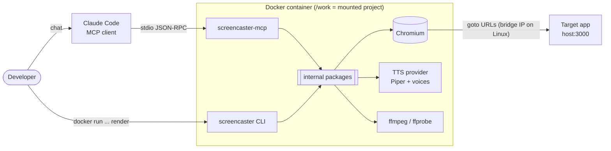
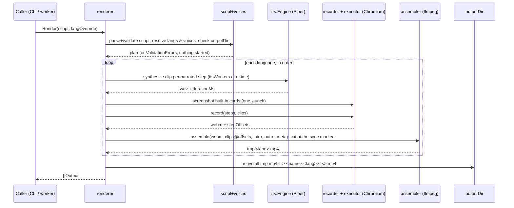
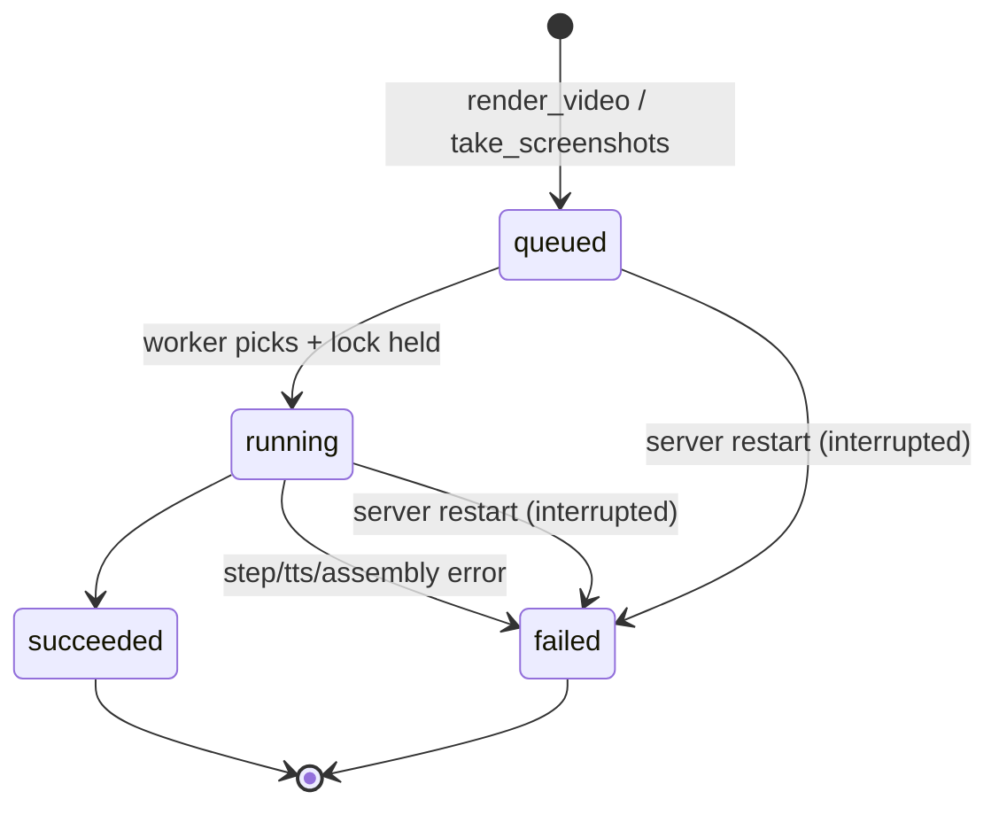

# screencaster — Architecture

**Version:** 0.3 | **Date:** 2026-10-08 | **Based on:** [PRD v1.3](PRD.md) | **Code rules:** [CODE_QUALITY.md](CODE_QUALITY.md) | **Status:** Draft

This document holds the structural rules: how the code is divided, what may depend on what, and the invariants the render pipeline keeps. *What* the product does is in the PRD; constants, formats and measurements live in the code and its tests. Requirement IDs (BR-, FR-, NFR-, BP-) link back to the PRD.

## 1. Context and design drivers

| Driver | Source | Consequence |
|--------|--------|-------------|
| Re-render is deterministic, no LLM at render time | BR-001 | The render engine is a pure function of (script, voices, target app). Claude Code only authors YAML. |
| Narration and action start together; the next step waits for both | BR-003, FR-007 | Audio is never played live. Clips are placed on a timeline by recorded offsets and mixed offline. |
| Any step failure aborts everything, no partial output | BR-004, FR-008, FR-010 | Work in a temp dir, publish only after every language succeeded. |
| Offline, $0 | NFR-003 | Render has no network calls other than Chromium's. The one HTTP client (`adapters/download`) is reachable only from `setup`, the explicit install command (Decision 77). |
| One developer, few videos | PRD §9 | Few moving parts: one process, one worker, one SQLite file. No scale design. |
| Same selectors in explore and render | Decision 23 | One step executor serves both. |

Non-goals: multi-tenancy, parallel rendering, auth, any UI (PRD §10.3).

## 2. System context



Two entry points are thin shells over one module's `internal/` packages. They share the pipeline and its wiring (`app/wire`).

## 3. Module view

One Go module (`module screencaster`, Decision 67), layered with `internal/`:

```
cmd/
  screencaster/            CLI: parse args, print progress, exit code        FR-011
  screencaster-mcp/        MCP main: store, worker, server, stdio             FR-012…FR-019
internal/
  domain/                  pure rules: no tool, no process, no SQL
    script/                types, embedded JSON Schema, cross-field rules     FR-001, FR-002
    voices/                resolve a voice per language over a catalog        BR-011, FR-018
    failure/               error types (no JSON tags)                         §9
    card/                  built-in start/end card page                       FR-009
    executor/              step execution (two modes)                         FR-005, FR-006
    recorder/              one language: steps -> video + offsets             FR-004, FR-007
    shooter/               one screenshots run: steps -> PNGs                 FR-020
  app/                     use cases; reach tools only through ports
    renderer/              Prepare (plan.go), Render (render.go), publish (publish.go)  FR-008, FR-010, FR-020
    explorer/              explore_page logic                                 FR-017
    jobs/                  Job, statuses, the single worker, Store port       FR-014, FR-015
    setup/                 `screencaster setup`: check and install the native tools (pins.go, setup.go)  Decision 77
    wire/                  composition root: TTS factory, NewDeps, Setup, port -> adapter mapping
  adapters/                one external tool or protocol each
    browser/               playwright-go: launch, context, screenshots, overlay.js, install (install.go)  FR-004, FR-020
    assembler/             ffmpeg: mix, cards, transcode, mux, tags           FR-009
    tts/                   Engine contract; piper/ (the only Piper code), wav/ (clip length)  FR-003
    sqlite/                jobs table, stored JSON, startup clean-up          FR-014, FR-015
    mcpserver/             MCP tools and prompt                               FR-012, 013, 017, 018, 019, 020
    lock/                  flock-based render lock                            §6.3
    osfs/                  the real file system behind renderer.Files and setup.Files
    download/              HTTP fetch with sha256 check, tar.gz extract (setup only)  Decision 77
    apt/                   apt-get install of ffmpeg (setup only)
    host/                  root, architecture and PATH lookups (setup only)
tests/e2e/                 same module, //go:build e2e
testdata/                  fixture app and sample scripts
providers/<name>/          one TTS provider's image layer: Dockerfile (dev + runtime stages), image-check.sh
scripts/                   screencaster-docker.sh: the template of the Docker wrapper shipped in the release
```

The JSON Schema sits next to the code that embeds it (`internal/domain/script`), because `go:embed` cannot reach a parent directory (Decision 55).

**Dependency rules**

- `domain` imports nothing from `app`, `adapters` or `cmd`, and no tool library (`os/exec`, playwright-go, SQLite, MCP SDK).
- `app` reaches tools only through ports it declares (`Synthesizer`, `Recorder`, `Shooter`, `Assembler`, `Cards`, `Files` in `renderer`; `Store` in `jobs`; `Fetcher`, `Browser`, `Packages`, `Files`, `Host` in `setup`). `app/wire` is the one exception: the composition root that maps the ports onto the adapters.
- Only `adapters/tts/piper`, `adapters/assembler`, `adapters/browser` and `adapters/apt` start subprocesses (`adapters/host` imports `os/exec` for `LookPath` only); only `adapters/browser` calls playwright-go, for launching and for `Install`; only `adapters/download` makes HTTP calls and only `setup` reaches it; only `adapters/sqlite` opens SQLite; only `adapters/mcpserver` and `cmd/screencaster-mcp` use the MCP SDK. `cmd/screencaster` imports neither the MCP server nor the job store.
- Both mains get the pipeline from `wire.TTS` and `wire.NewDeps`; neither builds a tool itself. `cmd/screencaster` gets the `setup` ports from `wire.Setup`.
- The renderer's port types (`RecordRequest`, `ShootRequest`, `AssembleRequest`, ...) repeat the wrappers' input shapes on purpose, and `wire` maps them field by field. That is duplication in letter, accepted so `renderer` names no tool package. Unit tests use fakes; only e2e uses the real tools.
- Enforced by `depguard` in `.golangci.yml` (file globs over these paths, test files included).

## 4. Render pipeline

`renderer.Render(ctx, Deps, Request)` is the single code path for CLI and MCP (BR-001, FR-011); the caller is the only difference. This section is the video pipeline; a `type: screenshots` script takes the branch at the end of it. `Deps` holds the tools, the voices, the clock and the run-ID source. `Request.Progress` and `Request.Log` report progress; the wording lives in `renderer`, the caller decides where it goes (stderr, `slog`; Decision 64).



Rules:

1. **Validate first.** Everything checkable without a browser or TTS is checked before either starts: schema, absolute `goto` URLs, narration per language, installed voices, paths inside the working directory (BR-011, FR-001, FR-002).
2. **Languages run sequentially**, each from a fresh browser context (FR-004).
3. **TTS before browser**, because clip durations decide step timing (FR-003). `synthesizeAll` makes the clips of one language, at most `ttsWorkers` at a time (1 today, Decision 71); the failure reported is always the lowest failing step. Cards come right after TTS, so a card problem fails before the slow part.
4. **Abort path.** The first step error cancels the context, closes the browser, deletes the temp dir and returns a `Failure`. Nothing reaches `outputDir`; a finished `en` is discarded when `pl` fails (BR-004).
5. **Publish last.** After all languages succeed, files move into `outputDir` with one shared timestamp (FR-010, BR-006). Every target is checked for existence first, existing files are never opened for writing, a cross-filesystem move goes through `<name>.part` then rename, and a failed move removes what the job already moved. Screenshots are the one exception (below).

### Screenshots runs (decisions 72–75)

After `Prepare`, `Render` branches on `Plan.Type`. A screenshots script has no languages, voices, TTS, cards, recording or assembly:

1. **Validate first.** The same rules, plus the type rules in `domain/script` (`checkType`, run by `Parse`, so `explore_page` actions are covered too). `Prepare` skips voices and cards and rejects a language override.
2. **Shoot.** `renderShots` calls the `Shooter` port, which is `domain/shooter`: a fresh, unrecorded browser (no cursor overlay), the ordinary steps through the executor, and `Session.Capture` at each `screenshot` step, writing `NN.png` (`shooter.ShotName`) under `<tmp>/<runId>/shots/`. Capture is in `adapters/browser`: it draws the annotation overlay (`overlay.js`, document coordinates) when asked, takes the shot with animations stopped and the caret hidden, and removes the overlay again.
3. **Publish last, with overwrite.** `publishShots` moves the PNGs into `<outputDir>/<name>/screenshots/`, replacing the previous run's files, then removes the `NN.png` files this run did not write. Other files and the folder itself are never removed, and no existing file is opened for writing (a cross-filesystem move still goes through `<dst>.part`). This is the deliberate exception to rule 5 and BR-006 (decision 73): the paths stay stable for docs that embed the images. A failure while publishing leaves a mix of new and old shots.
4. **Abort path** as for videos: the first failing step aborts the browser, the temp dir goes and nothing reaches `outputDir`.

The queue, worker and render lock (§6) are unchanged: the worker calls `Render`, which branches on the script.

## 5. Timing and synchronization model

The part most likely to go wrong, so it is defined precisely.

```
t0 (end of the sync marker) ─────────────────────────────────► recording time
 │   step1 start        step2 start               step3 start
 │   │ action ▓▓▓       │ action ▓▓                │ action ▓
 │   │ clip   ░░░░░░░░░░│ (no narration)          │ clip ░░░░
 │   └─ next starts at max(action end, start+clip)  └─ next starts at action end
```

- **t0** is a monotonic timestamp taken right after the sync marker is removed from the recorded page (Decision 69). A step's offset is `max(now − t0, 0) + narrationLag`: where its narration is placed (Decision 80). The assembler cuts the recording at the same moment, found in the video itself.
- Per step: record the offset, start the action, then wait until `max(actionEnd, start + clipDuration)` if narrated, where `start` is the step's start without `narrationLag`, else continue at `actionEnd` (BR-003, FR-007).
- Narration is not played while recording. The assembler places each clip at its offset and mixes offline, so sync does not depend on real-time playback.
- The transcode forces a constant frame rate, so video time equals wall time and offsets stay valid (Decision 50).
- The video is `intro card + recording + outro card`. The recorder knows nothing of the cards: its offsets are relative to the recording and the assembler adds the intro length. Every concat input is finite.
- Output length is the video length (FR-009.4). Clips are placed `narrationLag` after their step, so after the last step the recorder waits until the last placed clip ends before it closes the video: the video always covers the audio; the assembler mixes clips without padding.
- Drift target ±100 ms (FR-007), checked by the e2e test with the same bound, on the marker flash. The picture shows an action's effect 11–134 ms after the step starts, so `narrationLag` (70 ms, one value for every action, Decision 80) shifts the narration. With it, 5 local renders gave −13 to 80 ms (§17.1).

**Sync marker (Decision 69):** the video starts a variable time after page creation (bimodal, §17.1), so no constant aligns it. The recorded page therefore opens on a full-viewport magenta (`#FF00FF`) div over the start picture. The recorder holds it for `MarkerHold` (2 s, longer than the latest video start seen, 1.5 s), removes it, waits for two animation frames and takes t0. The assembler reads the first 4 s of the WebM as one averaged RGB pixel per frame, finds the first non-marker frame after a marker frame and cuts the recording there, so video time 0 is the recorder's t0. A recording without the marker fails with the `SyncMarker` failure; there is no fallback. The cut time is logged on every render (`sync marker ends at …`): a value near 2 s warns of a late video start. The marker costs about 2 s per language.

**Start page:** a new page is white until the first `goto` paints, which would flash white after the start card. The recorded page therefore shows the intro picture on the card background first (`recorder.Input.StartImage`), so the card carries on until the site appears; with no intro it is the plain card colour. The sync marker covers it until t0, so the picture is on screen from time 0 of the cut video.

## 6. Concurrency model

### 6.1 Processes

- `screencaster-mcp`: long-lived, one per Claude Code session.
- `screencaster`: short-lived, one per CLI render.
- Both may run at once on the same `/work`.

### 6.2 Inside `screencaster-mcp`

| Goroutine | Role |
|-----------|------|
| MCP server loop | Serves stdio. `render_video` and `take_screenshots` validate, insert a job and wake the worker. `get_render_status` reads SQLite. |
| Queue worker (exactly one) | Takes the oldest `queued` job, acquires the render lock (§6.3), sets `running`, calls `renderer.Render`, stores the result (BR-008, FR-014). |
| `explore_page` handlers | Run on the request goroutine, serialized by a mutex. They do not wait for the worker. |

Inside one render, `synthesizeAll` runs each narration clip in a short-lived goroutine and joins them before it returns; with `ttsWorkers = 1` (Decision 71) one runs at a time. It is the only fan-out in a render and no exception to "exactly one worker" for the queue.

**Explore may overlap a render** (Decision 44). Render timing can jitter, but offsets come from recorded timestamps, so narration stays correct. If it becomes a problem, add a shared browser semaphore; no interface changes.

### 6.3 Render lock

The CLI bypasses the queue (BP-003), so a lock file keeps a CLI render and an MCP job apart (Decision 45).

- `<work>/.screencaster/render.lock`, `flock(LOCK_EX)`; the kernel releases it on exit, so a crash leaves nothing stale. It works across containers sharing the bind mount.
- **CLI:** one non-blocking attempt; if held, print `another render is running` and exit 1.
- **Worker:** blocking acquire before the job becomes `running`; a waiting job stays `queued`.
- `explore_page` does not take the lock.
- MCP startup tries the lock without waiting before it clears `tmp/` (§11); if a CLI render holds it, the next start cleans up.

### 6.4 Shutdown

EOF on stdin or a signal cancels the root context: the browser closes, the temp dir goes, the process exits. The job row stays `running` and recovery marks it `interrupted` at next start (BR-009). Run containers with `--init` so signals are forwarded.

## 7. Step executor (shared)

One implementation of FR-005 semantics, two modes:

| | `render` | `explore` |
|---|---|---|
| Cursor overlay, mouse glide, typing delay | yes | no |
| Records step offsets | yes | no |
| Timeout per action | 30 s | 30 s |

Same selectors, same absolute `goto` URLs passed through unchanged (BR-010, Decision 78), same error shape. That is the guarantee behind FR-017 AC3: a selector returned by `explore_page` works in a render.

**Screenshot steps.** `screenshot` is a step action the executor does not run. `domain/shooter` intercepts it, because a capture needs an output path and a counter, which the executor (one step, no files) does not have; validation keeps it out of recordings and `explore_page`, and the executor's default case would return `unknown action` if one slipped through (decision 75). Every other step of a screenshots script runs through the executor in the mode `explore` uses (no visuals).

**Selector strictness.** A selector matching several elements fails instead of clicking the first. The executor uses strict locators, so `explore_page` emits only selectors that match one element and disambiguates with `>> nth=N`.

## 8. `explore_page` design

- Runs in a fresh, non-recorded context with the caller's `storageState`. The `url` is absolute, and so is any `goto` in `actions` (Decisions 59, 78).
- Replays `actions` through the executor in `explore` mode, then captures the page as an ARIA snapshot (Decision 47). Each named interactive line gets a ready-to-use selector, checked for uniqueness against the live page.
- Output is capped (`truncated: true`).
- On an action failure the tool returns `{step, action, target, message}` plus the snapshot at that moment (FR-017). The initial navigation is step 0.

## 9. Error model

One type travels everywhere (`internal/domain/failure`):

```go
type Failure struct {
    Step    *int   // 1-based; nil for non-step failures
    Lang    string
    Action  string
    Target  string // selector or URL
    Message string
}
```

| Kind | Produced by | CLI | MCP |
|------|-------------|-----|-----|
| Validation (list of `{pointer, message}`) | script, voices, renderer | print, exit 1 | tool error, no job created |
| Step | executor, shooter (a capture error is a step failure for the `screenshot` step) | print, exit 1 | `jobs.error_json` |
| TTS, Assembly, Cards, SyncMarker | tts adapter, assembler, renderer | print, exit 1 | `error_json.message` |
| Interrupted | startup recovery | n/a | `error_json` |

Step, TTS, assembly, card and sync-marker failures become a `Failure` before they leave `app`. A missing sync marker comes from the assembler as a sentinel (`ErrNoMarker`), which `renderer` turns into `failure.SyncMarker(lang)`: `sync marker not found in recording (<lang>)`. Messages name the step or phase and the language, and include the tool's stderr tail where there is one.

## 10. Job queue and persistence (MCP only)

SQLite (`modernc.org/sqlite`), file `<work>/.screencaster/jobs.db`; schema in PRD §13. Only the MCP process opens it. The worker and the job shape are a use case (`app/jobs`); the table is an adapter (`adapters/sqlite`) behind its `Store` port.

- FIFO by `(created_at, rowid)`. Timestamps use a fixed-width UTC layout so text order equals time order (Decision 57). A job's `position` counts the `queued` jobs before it plus one; a running job does not count. There is no job-kind column: a screenshots job is an ordinary job with an empty `languages` list, and the renderer tells the kind from the script (decision 75).
- WAL mode with a busy timeout. The worker is woken by a buffered channel on insert, no polling. Recovery runs first at start (FR-015).
- **Script snapshot.** `render_video` and `take_screenshots` read the YAML once, validates those bytes and stores them in `jobs.script`; the worker renders the stored bytes, so editing the file while a job waits changes nothing. `ScriptPath` still anchors the demo folder. Only the YAML is snapshotted: card images are read again at run time. A `jobs.db` from before the column gets it on open (`ALTER TABLE`); its rows keep `NULL`, and a job with no snapshot fails with `job has no script snapshot` (none can be queued: recovery has already failed them).
- **Stored JSON.** `outputs_json` and `error_json` keep their field names; `adapters/sqlite` maps the untagged domain types (`renderer.Output`, `failure.Failure`) onto private records, and golden tests pin the bytes. `get_render_status` has its own output types in `adapters/mcpserver`, also pinned by a golden test.



## 11. File layout

```
/work                          mounted project (rw)
├── demos/*.yaml               scripts: absolute goto URLs, optional storageState and outputDir (FR-001)
├── demos/assets/*             card pictures named by intro.image / outro.image
├── demos/output/              <name>.<lang>.<ts>.mp4, never overwritten
│   └── <name>/screenshots/    NN.png of a screenshots script, overwritten on rerun (decision 73)
├── voices/*                   extra voices for the active TTS provider (Piper: *.onnx + .json, FR-016)
└── .screencaster/
    ├── jobs.db                MCP only
    ├── render.lock
    └── tmp/<runId>/<lang>/    clips, video, cards, out.mp4
```

- Every path in a demo resolves against the demo file's folder and must stay inside the working directory (Decision 62).
- `runId` is the job UUID (MCP) or a random ID (CLI). The temp dir is removed on success and on abort.
- MCP startup removes stale `tmp/*`, only while it holds the render lock (§6.3).
- `.screencaster/` belongs in the project's `.gitignore`.

## 12. Docker image

- **Base plus provider layer (Decision 65).** The root `Dockerfile` names no provider: `dev-base` (toolchain for `make`), `build` (static binaries, `go build ./cmd/...` from the root module) and `runtime-base` (both binaries, Chromium, ffmpeg, no TTS). Each provider is a folder `providers/<name>/` with its own `Dockerfile` whose `dev` and `runtime` stages build `FROM` those bases (`DEV_BASE`, `RUNTIME_BASE` build args) and set the provider ENV, plus an `image-check.sh`. `providers/piper` also holds the `piper` fetch stage (Piper + voices, checksum-pinned), shared by its `dev` and `runtime`.
- **Build order.** `make dev-image` builds `screencaster-dev-base`, then `screencaster-dev` (tags `:<provider>` and latest). `make image` builds `screencaster-base`, then `screencaster:<provider>` and `screencaster` (latest). `PROVIDER` defaults to `piper`. `compose.yaml` only runs the built image, since compose cannot chain the two builds.
- **Provider selection.** The image sets `SCREENCASTER_TTS` (and the provider's own variables: `SCREENCASTER_PIPER_BIN`, `SCREENCASTER_PIPER_VOICES`). `screencaster-mcp` calls `wire.TTS` at startup; the CLI calls it when a render starts, so `--help` and `--version` work without a provider. Either way it fails with a clear message, before any render work, when the name is unknown or the Piper binary is missing. An unset name means `piper`, whose binary and voices default to the install dir `screencaster setup` fills (`<dir>/piper`, `<dir>/piper/voices`); the two Piper variables override. The image sets all three, so no image path lives in Go code and a native user sets none.
- Voice discovery belongs to the provider. The Piper adapter scans the image's voice folder and `/work/voices` on every call; the language is the voice name up to the first `_` (FR-018).
- **No `--shm-size`, no `--add-host` (Decision 79).** Playwright starts Chromium with `--disable-dev-shm-usage`, so the 64 MB default `/dev/shm` is enough. A host app on Linux is reached by the Docker bridge IP (`172.17.0.1` by default) written into the demo's `goto` URLs; Docker Desktop uses `host.docker.internal`. The app must listen on `0.0.0.0`. The container runs as root, so output files are root-owned.
- **Stdio hygiene.** MCP uses stdout for protocol frames, so all logging goes to stderr and subprocess output (Piper, ffmpeg, the Playwright driver) is captured, never inherited. A stray byte on stdout corrupts the session.
- **Native install (Decision 77).** `sudo ./screencaster setup` (use case `app/setup`) checks and installs five pieces under the install dir, `/opt/screencaster` or `SCREENCASTER_HOME`: Piper (`piper/`), the two built-in voices (`piper/voices/`), the Playwright driver (`playwright-driver/`), Chromium (`ms-playwright/`) and ffmpeg (system, apt). Piper and the voices are sha256-pinned: the values are not in Go but in `app/setup/pins.env` (embedded), which repeats the ARGs of `providers/piper/Dockerfile`; `pins_test.go` fails when the two differ. `LoadPins` merges three layers, each winning over the one before: the embedded `pins.env`, any `setup --pins-file` (same format, repeatable), and the environment (`SCREENCASTER_PIPER_VERSION`, `_PIPER_SHA256`, `_PIPER_URL_BASE`, `_VOICES_REV`, `_VOICES_URL_BASE`, and `SCREENCASTER_VOICE_FILES` with `name=path=sha256;...`). A layer that sets a Piper version must set its sha256; an unknown key is an error. An update needs no rebuild. The driver and Chromium come from one `playwright.Install` call (`adapters/browser`); ffmpeg from `apt-get` when apt exists, else an error naming the command. `setup.json` in the install dir records what was installed (Piper's pin; the release version for the driver and Chromium), so a rerun verifies each piece, skips the good ones and repairs the rest; a new release reinstalls the driver and Chromium. `setup --check` changes nothing and needs no root. `wire` points the render at the same dir: `wire.TTS` defaults to Piper there, and `wire.launcher` sets the driver dir and `PLAYWRIGHT_BROWSERS_PATH` unless `PLAYWRIGHT_DRIVER_PATH` / `PLAYWRIGHT_BROWSERS_PATH` are set (the images set them). `setup` refuses non-amd64 and, unless `--check`, non-root before any work. System libraries for Chromium come from `--with-deps` on apt systems only.
- **Release (Decision 76, amended by 77).** The `release` workflow is started by hand with a version `X.Y.Z`. It cross-compiles `screencaster` and `screencaster-mcp` for linux amd64 and arm64, adds `screencaster-docker` (the template `scripts/screencaster-docker.sh` with the version filled in: `docker run` of `ghcr.io/makuchpatryk/screencaster:X.Y.Z` with `--init` and `$PWD` mounted at `/work`) to each of the two tarballs and as a Release asset, runs `make image VERSION=X.Y.Z` and `make image-check`, pushes `ghcr.io/makuchpatryk/screencaster:X.Y.Z` and `:latest`, and creates the GitHub Release last, so a failed build leaves no half-published release. The version reaches both mains through one `-X main.version` flag (`var version = "dev"` in each); the `VERSION` build arg and `make` variable carry it into the `build` stage. The image is amd64 only (Piper is pinned to `piper_linux_x86_64` in `providers/piper/Dockerfile`); the native binaries run `screencaster setup` once (above) and need network, and Debian/Ubuntu for the automatic ffmpeg and Chromium libraries (README, Install).
- Go tooling runs in the dev image (Decision 52); `make image-check` runs the provider's own `image-check.sh` (for Piper: the built-in voices are in the image).

## 13. Testing strategy

| Level | Scope | Tools |
|-------|-------|-------|
| Unit | schema and cross-field rules, voice resolution, offset math, the wait rule, error formatting, queue ordering, recovery; `setup`: every check and install branch, root and architecture refusal, resume after a failure, the pins equal the Dockerfile ARGs; download (httptest, checksum, tar traversal), apt argument list, the Docker script template | `go test`, fakes for `Recorder`, `Session`, `Synthesizer`, `Assembler`, `Cards`, and for the `setup` ports; no network |
| Integration | SQLite store, lock semantics, MCP wiring over an in-memory transport | `go test` |
| E2E | fixture app → real render (EN, EN+PL), output format, drift, duration ratio (NFR-001), an `explore_page` selector used in a render; a screenshots run (sizes per capture area, annotation pixels, no overlay leak, overwrite and stale removal) | `make e2e` in the dev image; `make e2e-runtime` runs the CLI tests against the runtime image (Decisions 54, 56, 68) |

`Installer.Install` (the Playwright download) is not unit-tested. It is checked by hand before a release: on a bare `debian:bookworm-slim` (amd64) with network, extract the tarball, `sudo ./screencaster setup`, `setup --check` all `ok`, a second `setup` that changes nothing, and a non-root render of a fixture demo with no `SCREENCASTER_*` variable.

CI runs lint, vet and `go test -race` (one `check` job), an image build (`image`) and the e2e suite in the dev image (`e2e`, Decision 68). The e2e job has no Docker layer cache, so every run builds the images. The manual `release` workflow (§12) runs `make image-check` but not lint, tests or e2e: dispatch it from a green `main`.

## 14. Security notes

Local single-user tool (PRD §14), so the model is minimal:

- An inline `storageState` holds live session cookies: keep such a demo out of git.
- No outbound network from a render except Chromium to the demo's absolute `goto` URLs (NFR-003). `screencaster setup` is the one command that downloads, and only from pinned or fixed sources: `github.com` (Piper release, sha256-checked), `huggingface.co` (voices at a fixed revision, sha256-checked), `nodejs.org` and `registry.npmjs.org` (the Playwright driver, fetched by playwright-go) and the Playwright CDN (Chromium), plus the distro's apt mirrors for ffmpeg. It runs as root and writes the install dir and, through apt, the system.
- Scripts are data. YAML parses into typed structs, the schema rejects unknown fields, and selectors go only to Playwright. Paths in scripts and tool input are not trusted: they are checked against the working directory (Decision 58).

## 15. Extension points (post-MVP)

- **Slides / overlays** (PRD §10.2): only start and end cards exist for videos (Decision 63). Interleaved slides would change the recorder output and the assembler. Overlays exist for screenshots only (Decision 74: `overlay.js`, drawn by `Session.Capture`); in a video they would hook in as an executor init script, like the cursor.
- **New languages:** no code change, add the voice files under `/work/voices`.
- **Other TTS engines:** one adapter package `internal/adapters/tts/<name>` that satisfies `tts.Engine` (`Catalog`, and `Synthesize` into a PCM WAV), one case in `wire.TTS`, and an image layer: a folder `providers/<name>/` (Dockerfile with `dev` and `runtime` stages on the bases, plus `image-check.sh`; local binary: fetch stage + COPY + ENV; cloud or sidecar: ENV only). No existing file changes except the `wire.TTS` case. Script voice IDs are opaque per provider, so a switch may need `voices:` edits. A network provider must revisit NFR-003 and BR-001 first. Piper is the only adapter today.

## 16. Architecture decisions

Numbering continues the PRD Decisions Log (last: 43). 44–55, 58–60, 62–64 and 72–75 are also in the PRD log; 56, 57, 61, 65–71 and 76–79 are only here.

| # | Decision | Why |
|---|----------|-----|
| 44 | `explore_page` may overlap a render; no shared browser lock | Offsets come from timestamps, so correctness holds. Revisit if jitter shows. |
| 45 | `flock` file guards CLI against the MCP worker; CLI fails fast, worker waits | Kernel releases on crash; keeps the rule that the CLI has no queue or job record. |
| 46 | `t0` = just before page creation; fixed lead-in compensation, no trimming. Superseded by 69 | Fewer moving parts (§17.1). |
| 47 | `explore_page` = ARIA snapshot plus derived, uniqueness-checked selectors | Supported API; guarantees "selector works in render". |
| 48 | Logs to stderr only, subprocess output captured | Required by MCP stdio. |
| 49 | Clip duration read from the WAV header | No subprocess per clip; exact for PCM WAV. |
| 50 | Constant frame rate forced in the transcode | Video time equals wall time for the offsets. |
| 51 | `go.work` and `go.work.sum` are committed. Superseded by 67 | One source of truth for CI, the image and contributors. |
| 52 | Dev image from the start; every `make` target runs in it | The host needs only Docker; one toolchain everywhere. |
| 53 | `cobra` for the CLI | User choice; a documented deviation from KISS. |
| 54 | e2e in its own module, local only. Superseded by 67 (one module) and 68 (CI) | Keeps CI fast; the pipeline was not verified in CI. |
| 55 | Schema next to the package that embeds it (now `internal/domain/script/script.schema.json`) | `go:embed` cannot reach a parent directory. |
| 56 | `make e2e-runtime`: test binary built in the dev image, run inside the runtime image | Covers the image's binary, Chromium, Piper and ffmpeg with no network or docker-in-docker. |
| 57 | Job timestamps use a fixed-width UTC layout | `RFC3339Nano` trims zeros and breaks text ordering. |
| 58 | Each demo is one self-contained YAML (`storageState`, `outputDir` optional; `baseUrl` was required, removed by 78); no project config file. Supersedes PRD decision 15 | No hidden project state. Script and tool-input paths are LLM-written, so `renderer` confines them to the working directory. |
| 59 | `explore_page` takes an absolute `url` and an inline `storageState`; the url was also the `BaseURL`, amended by 78 (no base) | Nothing to read from disk; executor and explorer stay unchanged. |
| 60 | No project-level voice defaults: script, then built-in | Follows from 58. |
| 61 | `storageState` is an inline object in Playwright's shape, not a file path | One self-contained file; no existence or path checks. |
| 62 | Demo paths resolve against the demo's folder and must stay inside the working directory. Supersedes the rejection in 58 | A demo, its videos and its pictures move together. |
| 63 | Every video gets a start and end card unless `false`; built-in cards are an embedded HTML page screenshotted by Chromium, a custom `image` is used as is; the assembler joins them with `concat` and shifts clip offsets by the intro | Chromium wraps text and has the Polish glyphs. Recorded cards would meet the bimodal start (§17.1). |
| 64 | Render log lines come from `renderer` through `Request.Log`; the caller chooses stderr or `slog` | One place for the wording; nothing on stdout. |
| 65 | The TTS provider sits behind `tts.Engine`, chosen by `SCREENCASTER_TTS` at startup; the image is `runtime-base` plus one provider layer, and each layer lives in its own `providers/<name>/` folder, not in the root `Dockerfile` | A new provider is one adapter, one `wire.TTS` case and one folder. Piper details stay in `internal/adapters/tts/piper` and `providers/piper`; the image owns the provider and its paths. |
| 66 | Stay on `github.com/mxschmitt/playwright-go`; no move to `playwright-community` | Both paths serve v0.6201.1 from the same commit, and from v0.6100 the upstream `go.mod` declares the mxschmitt path, so requiring the community path fails with "module declares its path as …". Re-check on every playwright-go bump. |
| 67 | One module (`module screencaster`) with `cmd/` and `internal/{domain,app,adapters}`; no `go.work`. Supersedes 51 | `internal/` gives real import enforcement on top of depguard, and the image, CI and `make` build from one root. |
| 68 | e2e runs in CI on every push and PR (`e2e` job: dev image, then `make e2e`). Supersedes 54 in part | The drift check guards nothing if it never runs. No retries: a flaky run is data for the drift bound. Costs CI minutes; no layer cache yet. |
| 69 | Sync marker: the recorded page opens on a magenta marker held 2 s; the recorder starts t0 when it is removed, the assembler finds that frame in the WebM, cuts there and fails with `SyncMarker` if it is missing. Supersedes 46 | The video start is bimodal (0.5–1.5 s late), so a constant is wrong in some runs; a marker is measured per recording. A short flash would be missed in the late mode; an adaptive hold needs frame events Playwright does not give. Costs about 2 s per language. |
| 70 | Steps use the keyed form: the action is the step's key (`- click: "#id"`), its value a string, number or small object; Go has one type per action shape | The schema's shape alone decides each action, so the executor needs no field checks. A breaking change: repo YAML migrated, an old-form script gets one hint. |
| 71 | `synthesizeAll` can synthesize a language's clips in parallel, but `ttsWorkers` is 1 | Measured about 1.07× with 4 workers on the 3-clip e2e script (Piper is already multi-threaded), under the 1.3× bar. The pool stays as a tested, one-constant switch. Failure reporting is by lowest step, so results match the sequential loop. |
| 72 | `type: video\|screenshots` on the script; keyed `screenshot: true \| {selector\|fullPage\|clip, annotate}` steps only in screenshots scripts; screenshots scripts forbid narration, intro, outro, languages and voices | `--screenshots-only` flag; screenshots as a side output of a video | User choice. One script, one output kind; the keyed object keeps one action key per step (Decision 70). |
| 73 | Screenshots publish to `<outputDir>/<name>/screenshots/NN.png`, overwritten on rerun; stale `NN.png` removed, other files kept. Exception to BR-006 and §4 rule 5 | Timestamped run folder | User choice. Stable paths for docs and READMEs that embed the images. |
| 74 | Annotations (box, arrow, label, dim) are a DOM overlay in document coordinates, injected before the capture and removed after; opt-in per step | Go image post-processing | User choice. Chromium already renders the text and glyphs; no new dependency. |
| 75 | `domain/shooter` runs a screenshots run and intercepts `screenshot` steps; the executor is unchanged; the renderer reaches it through a `Shooter` port wired in `app/wire`. `take_screenshots` reuses the queue, worker, lock and `get_render_status`; no job-kind column | `Page.Screenshot` plus an executor case; the capture loop in `adapters/browser`; a separate queue | The executor stays file-agnostic and its fakes untouched; step semantics stay in one place; the renderer branches on the script type, so the worker needs no change. |
| 76 | Releases are cut by hand: the `release` workflow takes a version, builds linux amd64 and arm64 tarballs (`screencaster`, `screencaster-mcp`; amended by 77: no `playwright`, plus `screencaster-docker`) with plain `go build`, pushes an amd64-only image to GHCR and creates the GitHub Release last. The version is injected once by `-ldflags -X main.version`; native binaries install their tools with `setup` (77) | GoReleaser; tag-push or per-commit triggers; a multi-arch image; extracting binaries from the Docker `build` stage; a `version` subcommand | User choice for the manual trigger, the amd64 image, `--version` and the shipped `playwright` CLI. Two binaries and one OS do not need a release tool; Piper is pinned to x86_64, so an arm64 image would be untested by `make e2e-runtime`; the binaries cannot fetch their driver and Chromium, and a user without Go cannot build the CLI. |
| 77 | One `screencaster setup` command (use case `app/setup`, ports for download, browser install, apt, files and host) installs Piper, the voices, the Playwright driver, Chromium and ffmpeg into a compiled-in install dir `/opt/screencaster` (`SCREENCASTER_HOME` overrides); `--check` reports without changing; pins live in an embedded `pins.env` (parity test with the Dockerfile ARGs), overridable by `--pins-file` files and `SCREENCASTER_*` variables so an update needs no rebuild; `SCREENCASTER_TTS` unset means piper at the install dir; Playwright is installed through playwright-go's `Install`, so no CLI ships; the Docker path is a separate script `screencaster-docker` in the tarball; the Dockerfiles keep their own install layers | A shell `install.sh` with a `pins.env`; one adapter package called from `cmd` without a use case; install into `~/.cache` with `SUDO_USER`; shipping the `playwright` CLI; a `docker-install` subcommand | The README's three manual steps were the main barrier to native use. A use case with ports tests every branch with fakes and keeps `wire` the one composition root; a fixed dir readable by all users means any user can render after one root run; the library already covers the CLI's options, so one binary less ships (cost: Node.js and npm downloads at setup); a separate script lets a Docker user take one file. Costs: pins in two places (guarded by `pins_test.go`), and `render` is still offline while one new command uses the network. |
| 78 | `baseUrl` is removed; every `goto` is an absolute http(s) URL, checked by `domain/script` (`AbsoluteHTTP`) and passed through the executor unchanged; a relative `goto` fails at `/steps/<i>/goto`; a script that still has `baseUrl` gets one hint at `/baseUrl` and no other error. Amends 27 (PRD), 58 and 59 | A deprecation warning; the hint plus the schema errors (the decision 70 pattern); resolving against the explored page in `explore_page` | User choice: a hard break. One URL rule in Go, no resolution code in the executor, no base plumbing through shooter, recorder, explorer and browser. Cost: a demo hardcodes the app's address. |
| 79 | The Docker wrapper (`screencaster-docker`), `compose.yaml` and `make` targets set neither `--shm-size` nor `--add-host`. Playwright's default Chromium switches include `--disable-dev-shm-usage`; a Linux host app is reached by the bridge IP in the demo, Docker Desktop by `host.docker.internal`. Amends 76's wrapper flags | Resolving `host.docker.internal` to the gateway in Go (`/proc/net/route`, `--host-resolver-rules`); keeping `--add-host` for host-app demos | User choice: the shortest command that renders; no DNS code, no native-run question. A Playwright upgrade that drops the switch brings back the shared-memory crash: `make e2e` runs without the flag and catches it. |
| 80 | The recorder places each narration clip `narrationLag` (70 ms, a constant) after its step starts, for every action, and after the last step waits until the last placed clip ends. The wait between steps stays `start + clip`. Amends 69 (no bias constant) | A per-run calibration probe; detecting the effect frame in the video; taking the offset after the action returns; waiting `start + lag + clip`; shifting in the assembler or renderer | Paint and screencast latency put the effect 11–134 ms after the step start, so half the renders broke ±100 ms. A constant centres the spread, adds no run time beyond the tail, and keeps FR-007 spacing exact. The old no-bias note measured the paint of `index.html`, not the marker. Cost: one value for every machine; `goto` is not exact. |

## 17. Open items for spikes

1. **Sync marker residual (Decision 69).** The marker removes the bimodal start (before it, in about a third of recordings video time 0 was about 0.5 s after `t0`). What is left is frame quantization (the WebM frame step is 33–66 ms) and compositor latency. Measured on the real marker flash (the earlier 25–66 ms figures were the paint of `index.html`, not the marker), the picture trailed the narration by 10–182 ms in 14 renders, and by 11–134 ms in 6 after `Press` stopped waiting for navigation: about half the runs broke ±100 ms. Decision 80 places narration `narrationLag` = 70 ms after the step start; 5 renders gave −13 to 80 ms. Open: the constant was taken from 6 renders, not calibrated over 20, and the 20-of-20 run was not done; the 80 ms maximum leaves 20 ms, so a slower machine may need a larger value. A `goto` waits for the load and is not covered by the gate. A higher recording frame rate would shrink the 33 ms grid. Guarded by `TestRender_cli` (drift), `TestMarkerEnd_generatedClip` and the recorder's marker tests.
2. **Strict locators.** playwright-go locators are strict by default; an ambiguous selector fails fast with the candidates, so the executor needs no pre-check. Guarded by `TestBrowser_ambiguousSelectorFailsFast`.
3. **Piper (Decision 49).** `piper --model <voice>.onnx --output_file <out.wav>` with the text on stdin; the output is PCM s16le mono and the header duration matches ffprobe. Piper prints the output path on stdout, so stdout must not be inherited. Guarded by `TestParse_durationFromHeader` in `internal/adapters/tts/wav`.
4. **ARIA snapshot (Decision 47).** `Locator("body").AriaSnapshot()` gives one `- role "name" [attrs]: value` line per node, indented by nesting; a regexp over the leading role and name is enough to derive selectors. The `role=` selector matches the whole name, so uniqueness checks and `>> nth=` are only needed for repeated names. Guarded by the explore e2e tests and the mapper unit tests.
5. **Cards (Decision 63).** The built-in card renders the Polish letters (`TestScreenshot_polishGlyphsAreDistinct`), and looped stills joined with `concat` end at the sum of the parts with audio still in sync.
